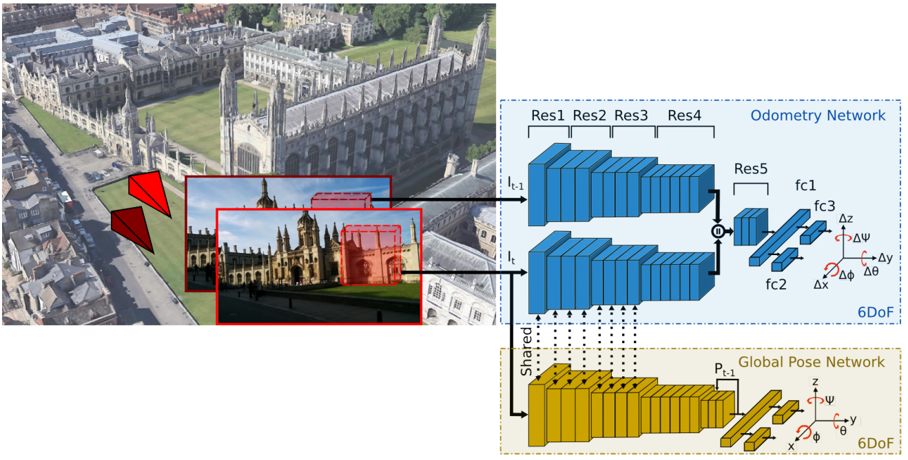

# VLocNet
A pytorch implementation of VLocNet, as described in [Deep Auxiliary Learning for Visual Localization and Odometry.](https://arxiv.org/pdf/1803.03642.pdf)

I worked on the [Microsoft 7-Scenes dataset](https://www.microsoft.com/en-us/research/project/rgb-d-dataset-7-scenes/) for this project. Just like the paper, I have omitted the depth map while building the pipeline, and trained a siamese-type Convolutional Neural Network to predict the Global position of the camera, and the relative transformation (change in orientation) between two consecutive frames.

It became an auxiliary learning task. For every batch in the training set, I trained the model first on the Relative Transformation task, and then, the Global Localization Task. This process is also called Alternate optimization. The paper I mentioned has said that this approach is more efficient than the Joint optimization approach (optimizing on both tasks simultaneously), and that is why I went ahead with it.

## Architecture
Here's the architecture of the model I built and trained. I used the weights from the ResNet-50 model trained on the ImageNet dataset, and trained this entire pipeline on Google Colab for about 48 hours. 

The paper reported a Median Localization Error of 0.048 meters (48cm), while my experiments got me about 0.35 meters (350 cm). Maybe a little more optimization, and switching up how I've implemented it would help. Do message me on LinkedIn, or submit a PR if you feel like it could be improved!

Show some ❤️ by ⭐ing this repository!
